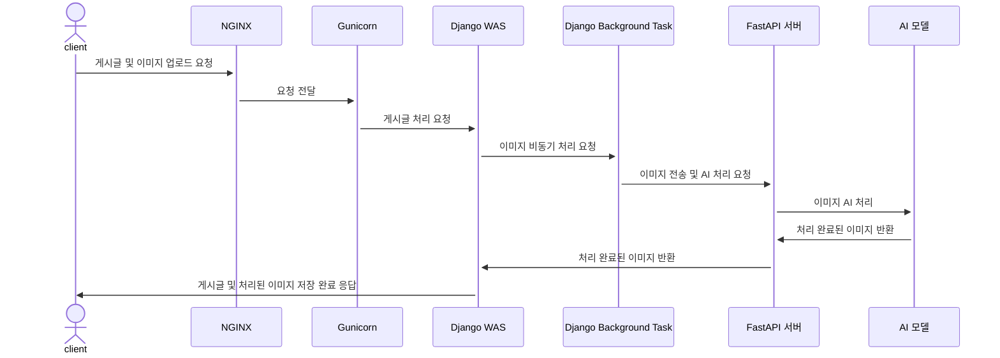
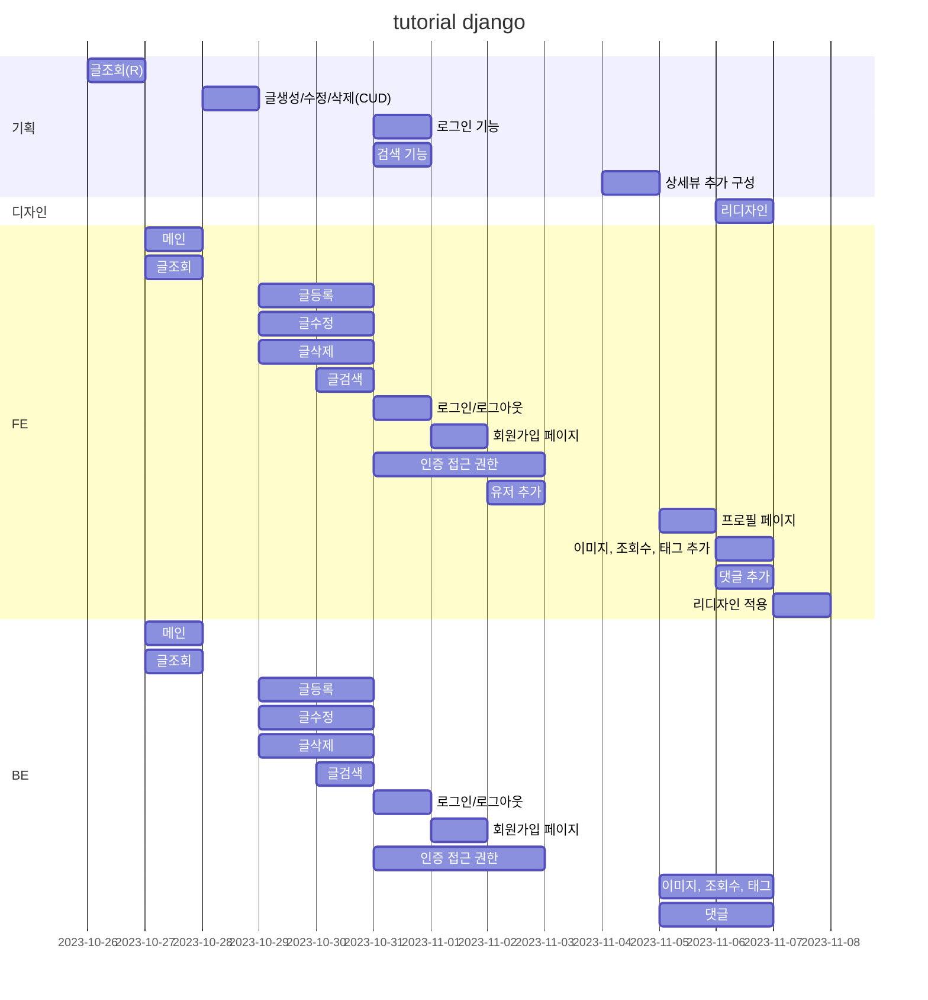
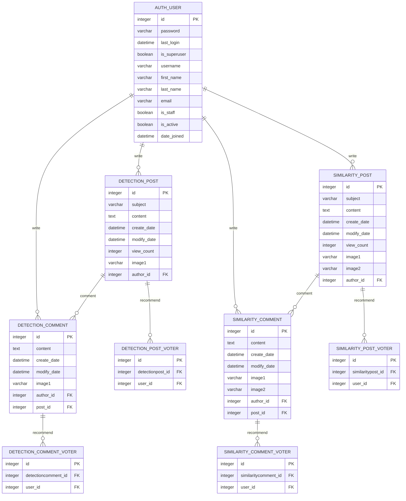
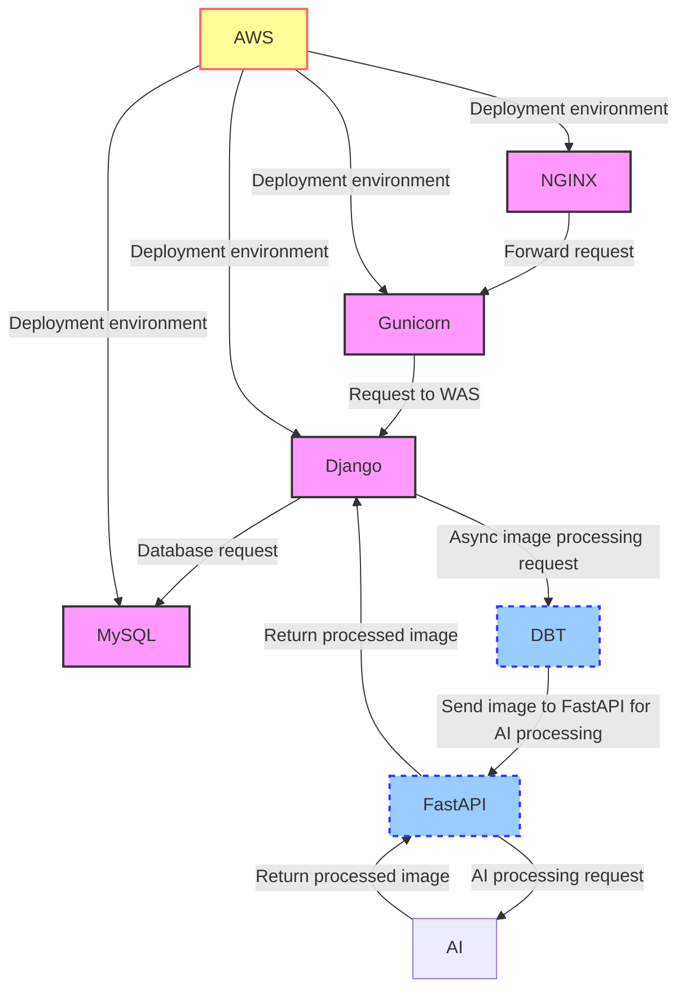
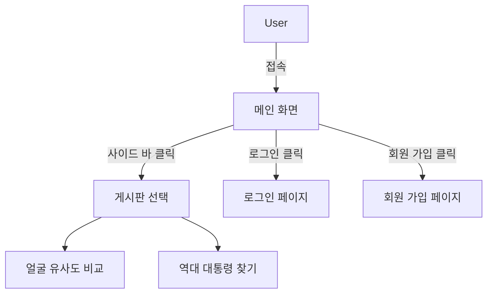
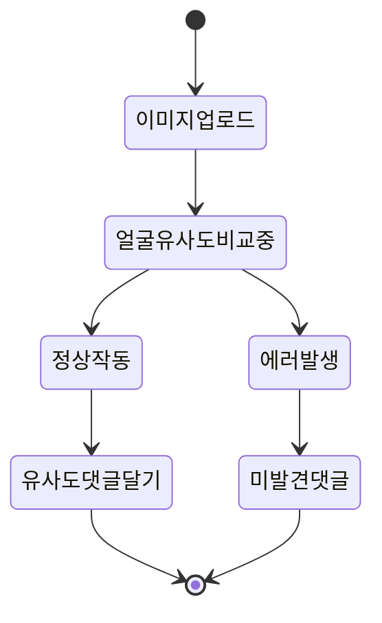
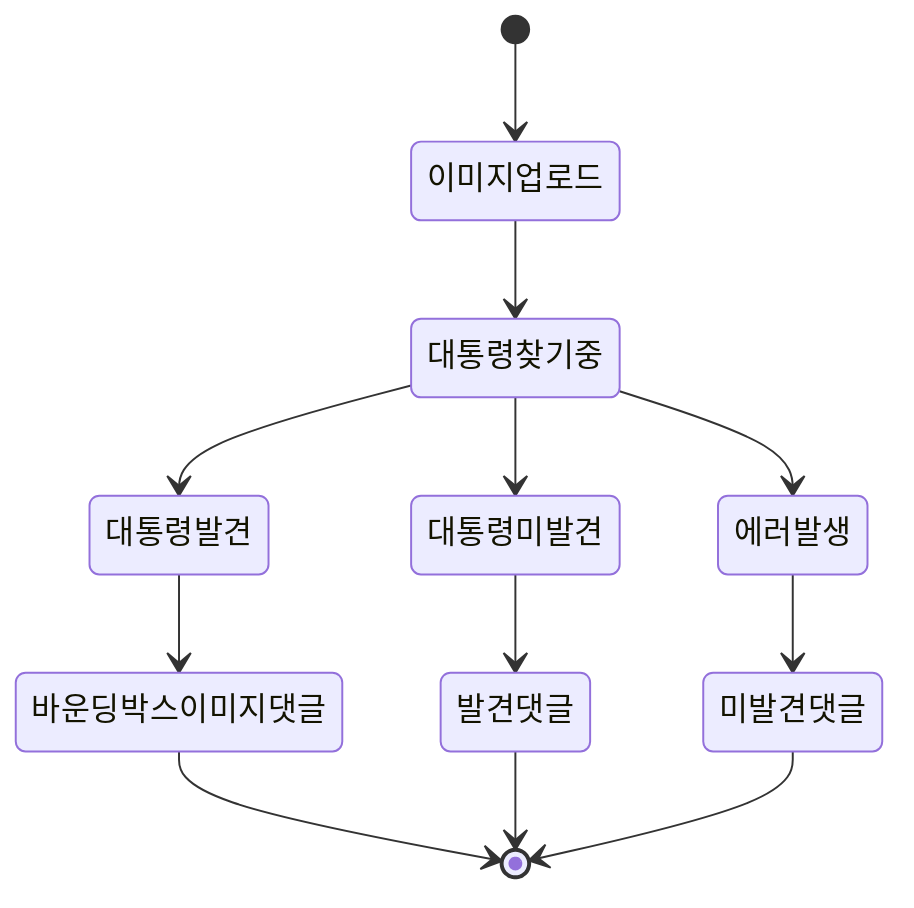

# 크로스 플랫폼 프레임워크 기반의 유명인물 영상 분석 서비스

## 1. 목표와 기능

### 1.1 목표

우선, 서비스는 사람들이 알고 접하는 것이 중요합니다. 이를 위해 먼저, 유명인물 영상 분석 서비스로 미국 대통령들과 후보를 유명 인물로 선정하여 미국 선거 관리위원회 및 기타 단체에 제공하고, 우리의 프로젝트를 알릴 수 있는 기회를 얻을 수 있습니다. 추가로 투표율과 관심도를 올릴 수 있는 효과를 낼 수 있습니다.

### 1.2 기능

- 유사도 측정 기능
- 유명인물 탐색 및 정보 제공 기능
- 두 기능을 통한 결과 AI 답글 기능
- 커뮤니티 및 상호 작용 기능
- DB 데이터 활용

### 1.3 팀 구성
<table>
   <tr>
      <th>박상준</th>
      <th>조하나</th>
      <th>이예은</th>
      <th>강유화</th>
   </tr>
   <tr>
      <td></td>
      <td></td>
      <td></td>
      <td></td>
   </tr>
</table>

## 2.1 개발 환경

### 하드웨어 사양

- CPU: Intel Core i7-4770 @ 3.40GHz
- RAM: 16GB
- GPU: 내장 그래픽 사용

### 운영체제(OS)

- Windows 10 Home (64비트, 22H2)

### IDE 및 개발도구

- IDE: VSCode
- AI 및 데이터 분석 도구: Google Colab

### 사용 언어

- Frontend: HTML, CSS, JavaScript (JS)
- Backend 및 AI: Python

### Frontend

- JS 라이브러리: jQuery
- CSS 라이브러리: Bootstrap

### Backend

- Web Server: NGINX
- WSGI Server: gunicorn
- WAS (Python Web Framework): Django
- DB: PostgreSQL

### AI 모델 및 데이터 분석

- Python 라이브러리: OpenCV, TensorFlow, PyTorch, ultralytics, MTCNN 등
- AI 모델: YOLO, MTCNN, ResNet34 등

### 배포환경

- 플랫폼: AWS Lightsail
- 운영체제: Ubuntu 가상머신 (EC2)

### 형상관리

- Git, GitHub

## 2.2 배포 URL

- 추후 추가 예정
- 테스트용 계정
  ```
  id : test@test.test
  pw : test11!!
  ```

## 2.3 URL 구조 (모놀리식)

### main

| App       | URL            | Views Function    | HTML File Name        | Note       |
|-----------|----------------|-------------------|-----------------------|------------|
| main      | `/`            | index             | `main/index.html`     | 인덱스 화면 |

### similarity

| App       | URL                               | Views Function    | HTML File Name                | Note        |
|-----------|-----------------------------------|-------------------|-------------------------------|-------------|
| similarity| `post/create/`                     | post_create       | `similarity/post_create.html` | 게시물 작성   |
| similarity| `post/read/<int:pk>/`              | post_read         | `similarity/post_read.html`   | 게시물 읽기   |
| similarity| `post/update/<int:pk>/`            | post_update       | `similarity/post_update.html` | 게시물 수정   |
| similarity| `post/delete/<int:pk>/`            | post_delete       | `similarity/post_delete.html` | 게시물 삭제   |
| similarity| `post/vote/<int:pk>/`              | post_vote         | `similarity/post_vote.html`   | 게시물 추천   |
| similarity| `post/list/`                       | post_list         | `similarity/post_list.html`   | 게시물 목록   |
| similarity| `comment/create/<int:pk>/`         | comment_create    | `similarity/comment_create.html` | 댓글 작성   |
| similarity| `comment/update/<int:pk>/`         | comment_update    | `similarity/comment_update.html` | 댓글 수정   |
| similarity| `comment/delete/<int:pk>/`         | comment_delete    | `similarity/comment_delete.html` | 댓글 삭제   |
| similarity| `comment/vote/<int:pk>/`           | comment_vote      | `similarity/comment_vote.html`   | 댓글 추천   |

### detection

| App       | URL                               | Views Function    | HTML File Name                | Note        |
|-----------|-----------------------------------|-------------------|-------------------------------|-------------|
| detection | `post/create/`                     | post_create       | `detection/post_create.html`  | 게시물 작성   |
| detection | `post/read/<int:pk>/`              | post_read         | `detection/post_read.html`    | 게시물 읽기   |
| detection | `post/update/<int:pk>/`            | post_update       | `detection/post_update.html`  | 게시물 수정   |
| detection | `post/delete/<int:pk>/`            | post_delete       | `detection/post_delete.html`  | 게시물 삭제   |
| detection | `post/vote/<int:pk>/`              | post_vote         | `detection/post_vote.html`    | 게시물 추천   |
| detection | `post/list/`                       | post_list         | `detection/post_list.html`    | 게시물 목록   |
| detection | `comment/create/<int:pk>/`         | comment_create    | `detection/comment_create.html` | 댓글 작성   |
| detection | `comment/update/<int:pk>/`         | comment_update    | `detection/comment_update.html` | 댓글 수정   |
| detection | `comment/delete/<int:pk>/`         | comment_delete    | `detection/comment_delete.html` | 댓글 삭제   |
| detection | `comment/vote/<int:pk>/`           | comment_vote      | `detection/comment_vote.html`   | 댓글 추천   |

### 2.4 URL 구조(마이크로식)✅

- 추후 추가 예정

## 3. 요구사항 명세와 기능 명세

- 이미지는 샘플 이미지입니다.


- mermaid
  


## 4. 프로젝트 구조와 개발 일정
### 4.1 프로젝트 구조

```
Pybo0!Code
├─ 📂.env
├─ 📂.git
├─ 📂.gitignore
├─ 📂.vscode
├─ 📂common
│  ├─ 📜admin.py
│  ├─ 📜apps.py
│  ├─ 📜forms.py
│  ├─ 📜migrations
│  ├─ 📜models.py
│  ├─ 📜tests.py
│  ├─ 📜urls.py
│  └─ 📜views.py
├─ 📂config
│  ├─ 📜asgi.py
│  ├─ settings
│  │  ├─ 📜base.py
│  │  ├─ 📜local.py
│  │  └─ 📜prod.py
│  ├─ 📜urls.py
│  └─ 📜wsgi.py
├─ 📂logs
│  └─ 📜pybo.log
├─ 📜manage.py
├─ 📂pybo
│  ├─ 📜admin.py
│  ├─ 📜apps.py
│  ├─ 📜context_processors.py
│  ├─ 📜forms.py
│  ├─ migrations
│  ├─ 📜models.py
│  ├─ 📂templatetags
│  │  ├─ 📜custom_filters.py
│  │  └─ 📜custom_tags.py
│  ├─ 📜test.py
│  ├─ 📜urls.py
│  ├─ 📜url_patterns.py
│  ├─ 📂views
│  │  ├─ 📜base_views.py
│  │  ├─ 📜detection_comment_views.py
│  │  ├─ 📜detection_post_views.py
│  │  ├─ 📜similarity_comment_views.py
│  └─ └─ 📜similarity_post_views.py
├─ 📜README.md
├─ 📂static
├─ 📂templates
│  ├─ 📜base.html
│  ├─ 📜footer.html
│  ├─ 📜form_errors.html
│  ├─ 📜sidebar.html
│  ├─ 📜topbar.html
│  ├─ 📂common
│  │  ├─ 📜404.html
│  │  ├─ 📜login.html
│  │  └─ 📜signup.html
│  ├─ 📂pybo
│  │  ├─ 📜answer_list.html
│  │  ├─ 📜index.html
│  │  ├─ 📜question_detail.html
│  │  ├─ 📜question_form.html
│  └─ └─ 📜question_list.html
├─ 📂temps
└─ 📂txt
   ├─ 📜requirements.txt
   └─ 📜requirements_for_server.txt
```

### 4.1 개발 일정(WBS)
* 아래 일정표는 머메이드로 작성했습니다.


## 5. 역할 분담

- 팀장 : 강유화
- 박상준
- 조하나
- 이예은


## 6. 와이어프레임 / UI / BM

### 6.1 와이어프레임

- 아래 페이지별 상세 설명, 더 큰 이미지로 하나하나씩 설명 필요
- 추후 추가 예정


### 6.2 화면 설계
- 화면은 gif파일로 업로드해주세요.
 
<table>
    <tbody>
        <tr>
            <td>메인</td>
            <td>로그인</td>
        </tr>
        <tr>
            <td>
      
            </td>
            <td>
                
            </td>
        </tr>
        <tr>
            <td>회원가입</td>
            <td></td>
        </tr>
        <tr>
            <td>
                
            </td>
            <td>
                
            </td>
        </tr>
        <tr>
            <td>검색</td>
            <td></td>
        </tr>
        <tr>
            <td>
                
            </td>
            <td>
                
            </td>
        </tr>
        <tr>
            <td></td>
            <td>글쓰기</td>
        </tr>
        <tr>
            <td>
           
            </td>
            <td>
                
            </td>
        </tr>
        <tr>
            <td>글 상세보기</td>
            <td>댓글</td>
        </tr>
        <tr>
            <td>
                
            </td>
            <td>
                
            </td>
        </tr>
    </tbody>
</table>


## 7. 데이터베이스 구조도(ERD)



## 8. Architecture



- 아래 Architecture 설계도는 PPT를 사용해서 작성
- 추후 작성 예정


## 9. 메인 기능

- 사용자가 접속하면 메인 화면이 나오고 사이드 바에서 두개의 게시판으로 이동하거나 로그인 또는 회원 가입을 할 수 있습니다.



- 사용자가 두장의 이미지를 업로드하면 두 얼굴 간의 유사도를 비교해 줍니다.



- 사용자가 한장의 이미지를 업로드하면 그 중 미국의 역대 대통령이 있는지 찾아 정보글을 제공해줍니다.



## 10. 클래스 다이어 그램

## 99. 에러와 에러 해결

## 99. 개발하며 느낀점